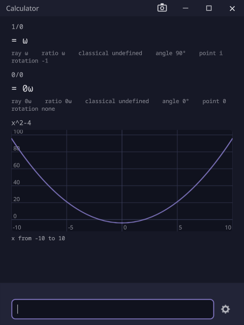

# Calculator

**An ordinary-looking calculator that divides by zero.**

`1/0` is `ω`, and `0/0` is `0ω`: an answer, not an error. Under it is traction, the number model built by
[cott-engine](https://github.com/sibarum/cott-engine) and proven in [cott-lean](https://github.com/sibarum/cott-lean).
The calculator implements only what the proofs cover.

## The tape

- **Type a line and press Enter.** The line, its answer and its readings go on the tape, newest last.
- **Every answer is read several ways**: `ray`, `ratio`, `classical` (what an ordinary calculator says, which is
  `undefined` for `1/0`), `angle`, `point` and `rotation`. The [cott-engine README](https://github.com/sibarum/cott-engine#the-projections)
  says what each one is.
- **A line with one free variable is plotted**: `x^2-4` draws its curve, with `x` from −10 to 10.
- **Definitions are kept**: after `x = 1`, later lines use it.
- **Numbers are exact.** Decimals are refused, so write `1/2`. Type `\o` for `ω`.
- **Past lines come back to the entry**: Up and Down step through them, a click on one brings it back, and Ctrl
  with a number picks one.

## Settings

The gear beside the entry opens them in a window of their own:

- **Arithmetic**: what a number is, and how `+ - * /` and `^` act on it. Definitions carry over when it changes.
- **Recursion limits**: how far the steps behind `cos` and `sin` may go. Each limit is a count of steps, not a
  time, so a line gives the same answer on every machine; a line that needs more is refused, not cut short.

A change applies to the lines entered after it. Lines already on the tape keep their answers.

## With the rest of the suite

Installing adds `calculator` to your PATH, so `calculator` in a [MainFrame](mainframe.md) tab opens one. It does not
open files, so the other applications have nothing to hand it.

## Status

Arithmetic, readings, plots and the settings work. It has not been released yet.

[Install the suite](../install/) · [Source](https://github.com/sibarum/calculator-vexel-demo)
