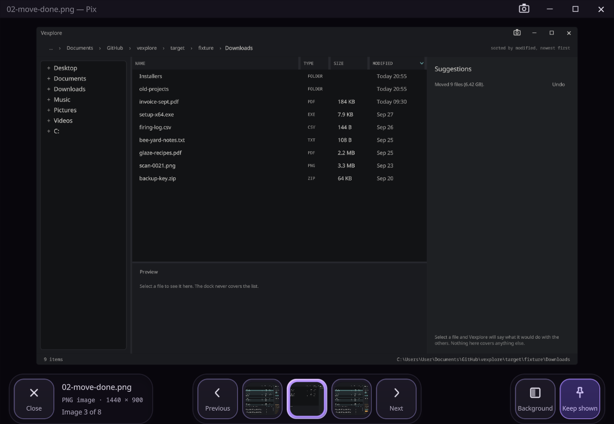

# Pix

**An image viewer: one picture, as large as the window allows, and the rest of its folder a key press away.**

Open a picture and Pix shows it whole, never enlarged past its own pixels, with the folder it is in one arrow
key away. The picture is never covered: the controls have their own room under it, and fade when the pointer
rests.

## Stepping through a folder

- **← and →**, Page Up and Page Down step to the previous and next image; **Home** and **End** go to the first
  and the last. The new picture slides in from the side it came from.
- **Holding a key is cheap.** The counter moves at once, and only the picture it stops on is decoded. The next
  ones are read ahead, and recent ones kept, so going back is instant.
- **The filmstrip** under the picture shows its neighbours; a click on one shows it.
- Images are in name order, with numbers compared as numbers, so `IMG_9` comes before `IMG_10`.

## Formats

PNG, JPEG, GIF, WebP, AVIF, BMP, TIFF, SVG, ICO and the rest, animated where the file is. A file that is not a
picture, or will not decode, says why in place of the picture. Nothing in a file is ever run.

## The view

- **Background**: dark, light, a checkerboard for transparency, magenta or green, across the whole window.
- **Keep shown** stops the controls fading. Moving the mouse, a click or Tab brings them back.
- **Esc** closes Pix.

## With the rest of the suite

Open a picture in [Vexplore](vexplore.md) and it goes to Pix. Without Pix, Vexplore shows it in a viewer of its
own, which is the same viewer. `pix <file>` opens a picture and `pix <folder>` the first one in a folder.

## Status

Viewing and stepping through a folder work. Zoom, pan and rotate are not done yet, and nothing in Pix changes a
file. It has not been released yet.

[Install the suite](../install/) · [Source](https://github.com/sibarum/Pix)
