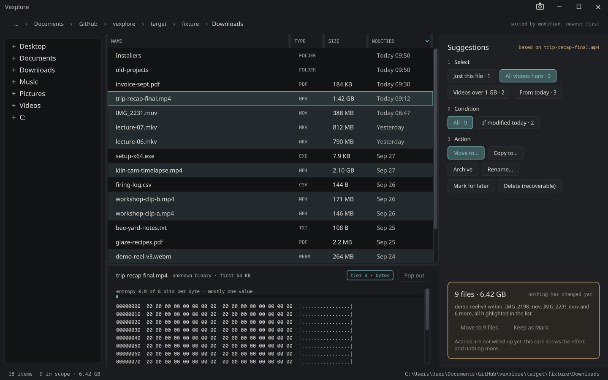
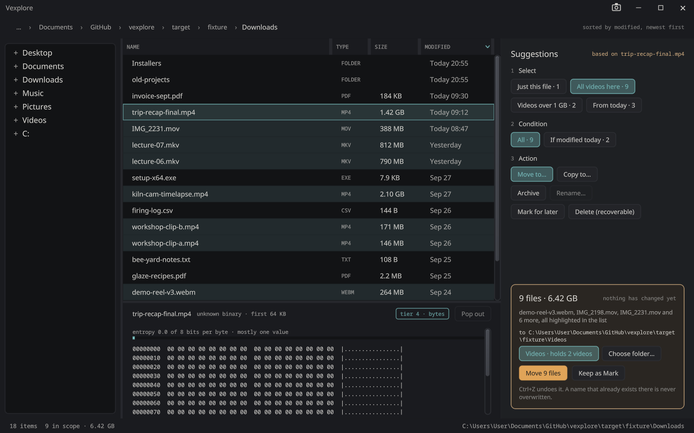

# Vexplore

**A file explorer that suggests instead of asking.**

Click one file and Vexplore offers what you probably meant next: *all the videos here*, *only the ones from
today*, *move them to the folder that already holds your videos*. Every suggestion says what it will affect
before you take it, and taking none of them costs nothing. The list does not move, and nothing covers it.

## Three clicks, not a dialog

The rail beside the file list asks the three questions a file operation needs, in order, as buttons:

1. **Select**: just this file, all of its kind here, the big ones, today's.
2. **Condition**: all of them, or only those modified today.
3. **Action**: move, copy, archive, mark for later, or delete.

The rows a suggestion would reach are marked in the list, not selected, so you see the reach before you commit
to it. Hold **Shift** to see where a range probably ends, or **Control** to see the rule your picks are examples
of.

## Nothing it does is final

- **It states the effect first.** Before anything runs, the card gives the counts, the bytes, where they go, and
  what would be left alone and why.
- **Every action can be undone**, with Ctrl+Z or the Undo button: move, copy, archive, delete and mark.
- **Delete is recoverable.** It goes to Vexplore's own trash, not straight off the disk.
- **A name that already exists is never overwritten.**
- **It never freezes.** Large operations run off the drawing thread, so the window keeps answering.

## With the rest of the suite

Open a text or source file and it goes to the [Text Editor](text-editor.md) in a new window, and a picture goes to
[Pix](pix.md). Anything else goes to whatever Windows normally opens it with. `vexplore <folder>` opens a
folder, and `vexplore <file>` opens the folder it is in with that file selected. That is how
the editor's *Open in Vexplore* works.

## Status

Browsing, the suggestion rail, the five actions and undo work. Rename, drag and drop, and inline previews
are not done yet. It has not been released yet.

[Install the suite](../install/) · [Source](https://github.com/sibarum/vexplore)
